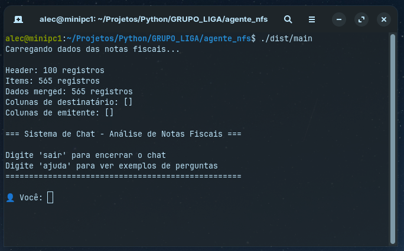
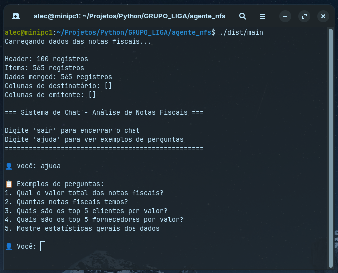
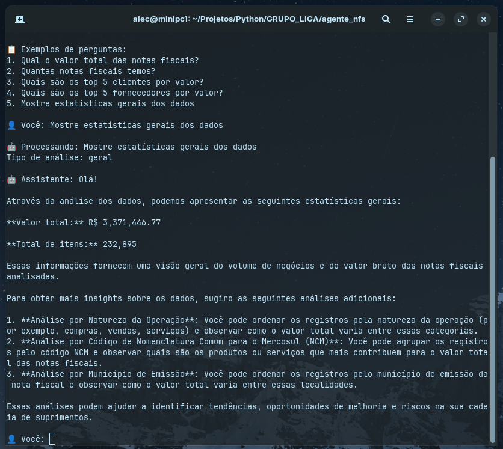

# Desafio 2 - 18/06

# Projeto de ChatBot para notas fiscais.

	o chatbot de notas fiscais é um sistema local que só funciona no terminal, 
	ele usa os arquivos de csv como base para realizar as suas pesquisas.
	Segue mais abaixo as imagens do sistema funcionando:
	
	
* Observação:

  - O executável só funcionará no Linux (ubuntu/debian)

  - Na mesma pasta do executável é preciso ter a pasta [data] com os arquivos csv dentro, para o sistema conseguir ler os dados.

  - Para o sistema de chatbot de notas fiscais funcionar é preciso instalar o Ollama no computador.
  
  - O computador precisa ter 6 Gb de memória livre só para o Ollama server executar,
    caso contrário ele vai gerar um erro:
    
		Assistente:			
		Erro ao processar pergunta: Ollama call failed with status code 500. Details: 
		{"error":"model requires more system memory (5.9 GiB) than is available (2.5 GiB)"}

* Instalar o servidor Ollama no computador
	
		curl -fsSL https://ollama.com/install.sh | sh

  - Executar o serviço llama3 no Ollama
	
		ollama run llama3

* Código fonte e o executável do sistema chatbot de notas fiscais: 

  - Em um terminal, faça o clone da pasta [GRUPO_LIGA]
  	
  	Em seguida acesse a pasta [agente_nfs] onde vai encontrar o código fonte, 
    e na pasta [agente_nfs/dist] vai encontrar um arquivo binario que é o executável do chatbot [main].

		./agente_nfs/dist/main
		ou 
		./main
  	
    Obs.: Para compilar o código fonte é preciso criar um ambiente virtual no python 3.12.11.

  - Caso tenha algum problema para executar o sistema de chatbot, baixe o sistema do google drive 
	
	  https://drive.google.com/drive/folders/11OEEUWhiPTQOOtvTxx5xGFoG68qJkH98
	  

		
* Figura 01 - Tela inicial do sistema onde o usuario irá interagir com o agente.

	

	
* Figura 02 - Tela de ajuda onde o usuario digitou "ajuda"

	

	
* Figura 03 - Tela de resposta depois de ter digitado "Mostre estatisticas gerais dos dados"

	
	

