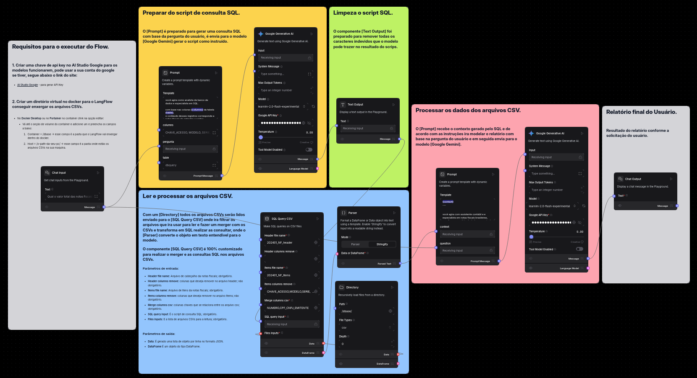

# Desafio 2 - 18/06

# Projeto de ChatBot para analise da notas fiscais em CSV.

  Segue a baixo o fluxos das tarefas para processar as notas fiscais feito em platafomra LangFlow, 
  são arquivos no formato JSON para que possa ser importados na plataforma os 
  requisitos para o sistema funcionar esta dentro do arquivo.

  - [Flow Notas Fiscaril dos arquivos CSV](./flow-notas-fiscais-csv.json) baixe o arquivo para importar na plataforma Langflow.

      
